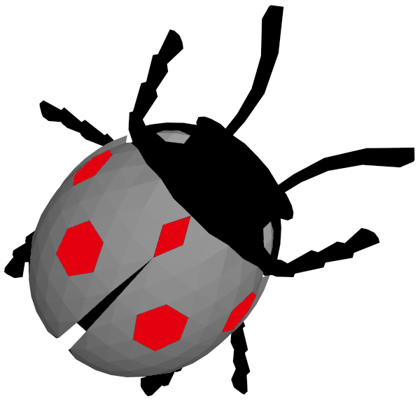

# Codesys-Webots Bridge

<div align="center">
  
  
  <br/>
  
  **Seamlessly bridge CODESYS and Webots for industrial robot visualization and control.**
  
  [](https://www.codesys.com/)
  [](https://cyberbotics.com/)
  [](https://opensource.org/licenses/MIT)

  [Features](#features) • [Quick Start](#quick-start) • [Demos](#demos) • [Building](#building)
</div>

---

## Overview

**One Command → Everything!**

This tool acts as a unified code generator, creating Webots controllers and CODESYS libraries from a simple JSON schema. Visualize mechanisms, simulate physics, and drive robots directly from your PLC code using shared memory.

## Features

- **Automated Generation**: Create C++ controllers and PLCopenXML files from a single JSON schema.
- **Shared Memory Bridge**: Zero-latency communication between CODESYS and Webots.
- **Unified Workflow**: Define your robot once, deploy to both environments.
- **Documentation**: Auto-generated guides for every new robot you create.

## Prerequisites

Before you begin, ensure you have the following installed:

1. **Webots 2025a** (or compatible version)
2. **CODESYS V3.5 SP20+**
3. **Msys64** (MinGW-w64) for building the C++ code

## Quick Start

### 1. Initial Setup (Run Once)
Run the setup script to create necessary output directories:
```powershell
.\setup.ps1
```

### 2. Generate Files
Generate the bridge code for your robot (e.g., Puma560):
```powershell
.\CodesysWebotsBridge.exe schemas\puma560.json
```

### 3. Integrated Workflow
1.  **Write Schema**: Create your robot definition in `schemas/YourRobot.json`.
2.  **Generate**: Run the tool as shown above.
3.  **CODESYS**: Import `generated/codesys/*.xml` and add the "ToWebots" library to your project.
4.  **Webots**: Copy `generated/webots/*` to your Webots project's controller directory.
5.  **Simulate**: Start Webots and login to your CODESYS controller.

## Output Structure

The tool organizes generated files into a clean structure:

| Directory/File | Description |
| :--- | :--- |
| `generated/` | Output folder for all generated code |
| `schemas/` | JSON schemas for robot definitions |
| `src/` | Source code for the bridge tool (`main.cpp`) |
| `include/` | Header files (`UnifiedCodeGenerator.hpp`) |
| `build/` | Compilation artifacts |
| `Makefile` | Build configuration |
| `CodesysWebotsBridge.exe` | **Main Executable** |

## Demos

<div align="center">

### Puma560 Control
*Direct joint control from CODESYS*
<br/>
<video src="Media/preview.mp4" controls width="80%"></video>

<br/>

### Robotics Library Jogging
*Inverse kinematics and jogging with CODESYS SoftMotion*
<br/>
<video src="Media/preview2.mp4" controls width="80%"></video>

<br/>

### Dual UR10e Control
*Synchronized control of two robots*
<br/>
<video src="Media/preview3.mp4" controls width="80%"></video>

</div>

## Building from Source

If you want to modify the tool itself:

```powershell
# Option 1: Using Make
make

# Option 2: Using Build Script
.\build.bat

# Option 3: Manual Compilation
windres src/resource.rc -O coff -o build/resource.o
g++ -std=c++17 -Iinclude -o CodesysWebotsBridge.exe src/main.cpp build/resource.o
```

## Troubleshooting

- **No files generated?** Ensure you ran `.\setup.ps1` first.
- **Custom Schema Issues?** Refer to `schemas/puma560.json` as a template.
